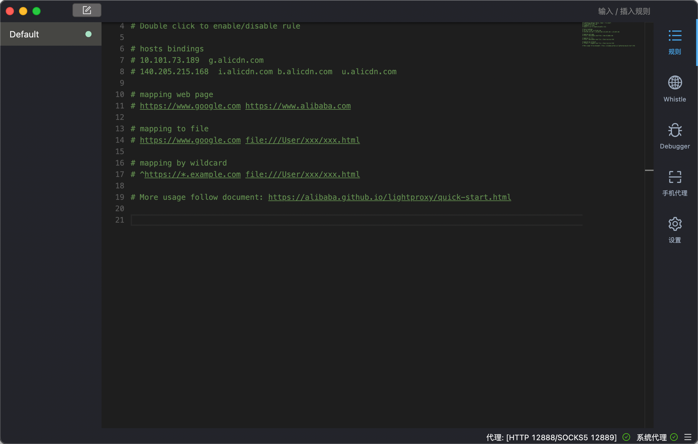
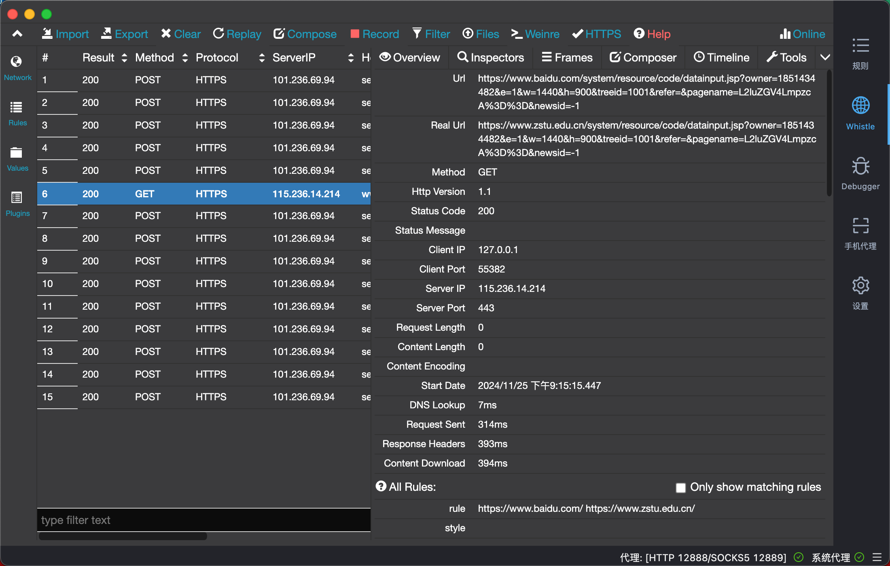
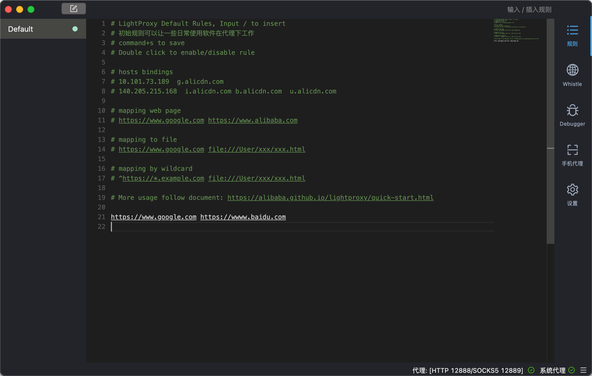
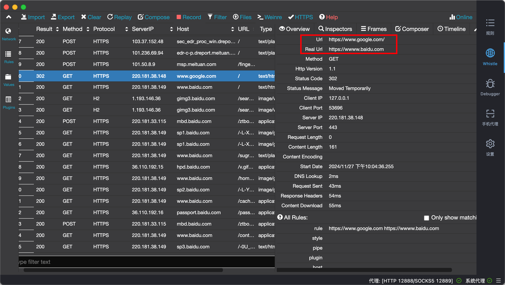
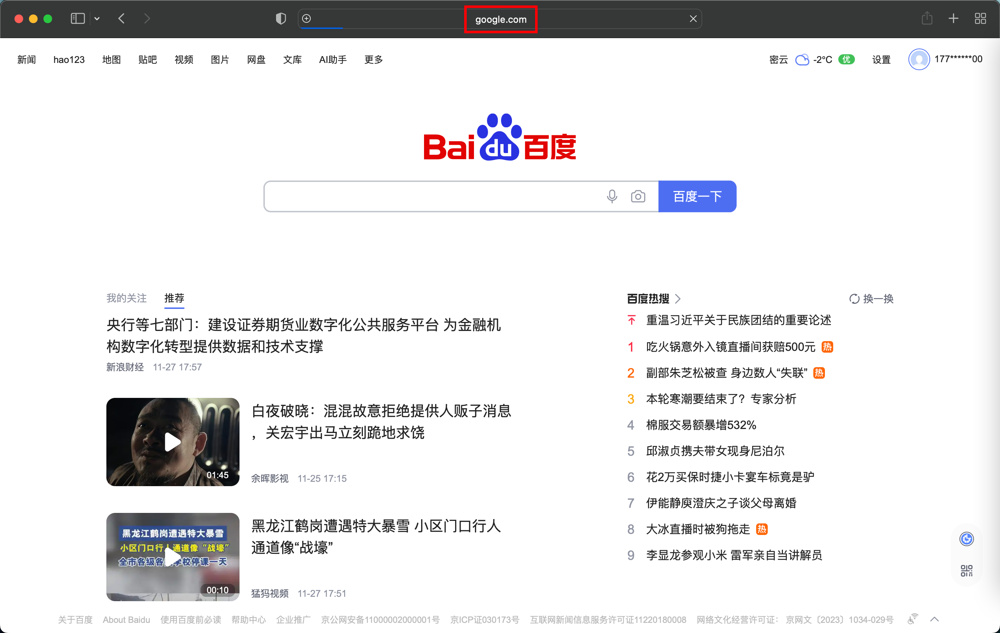

# LightProxy Usage Tutorial

## Concept

LightProxy is a powerful proxy tool that can intercept, modify, and forward network requests, making it convenient for developers and non developers to debug, analyze, and customize network data. It is like a "middleman" for network requests, allowing users to clearly see the detailed information of requests and responses, and adjust them as needed.

## Applicable objects

### （I）Developer

For developers, LightProxy is an indispensable development tool.

- Debugging Interface: Quickly locate issues that arise during interface calls, such as parameter errors, abnormal response data, etc.
- Simulate different network environments: Test the performance of applications under different network conditions, including latency, bandwidth limitations, etc., to optimize the network adaptability of applications.
- Validate security strategy: Check for network security vulnerabilities in the application, such as data leakage risks, by intercepting and analyzing request and response data to ensure that the application complies with security standards.

### （II）Non developer

Non developer users can also benefit from LightProxy. For example:

- Ordinary network users can use LightProxy to view the network request status of applications on their devices, understand the data interaction behavior of applications in the background, and better protect personal privacy and data security.
- Internet enthusiasts: Those who are interested in the principles of network requests and want to gain a deeper understanding of network data transmission mechanisms can use LightProxy to learn and explore, and visually observe the entire process of network requests.

## How to use LightProxy

### （I）How to download and install

1. Firstly, download the corresponding installation package from LightProxy's official website based on your operating system type (such as Windows, Mac, or Linux).
   - Download URL MAC: https://gw.alipayobjects.com/os/LightProxy/LightProxy.dmg
   - Windows：https://gw.alipayobjects.com/os/LightProxy/LightProxy-Setup.exe

2. After downloading, run the installation program and follow the prompts to gradually complete the installation process. During the installation process, you may need to agree to some software license agreements and select basic settings such as installation paths.

After successful download, you need to follow the prompts to install the command on the terminal.

### （II）User interface and functional operation

#### Rule module

In this rule interface, corresponding rules can be configured, allowing users to define and manage various proxy rules as needed. Whether it's request interception, response modification, API simulation, or cross domain problem troubleshooting, LightProxy can provide flexible solutions. By configuring rules, users can efficiently develop and test, improving work efficiency.

#### Whistle module

For developers, the Whistle module is a powerful HTTP debugging proxy tool that can intercept, modify, and redirect requests and responses through configuration rules. Whether it's front-end development, API testing, or performance optimization, Whistle can provide flexible solutions to help developers improve development and testing efficiency.

For non developers: With Whistle, you can view, modify, and redirect network requests for privacy protection, ad blocking, cross domain troubleshooting, API debugging, and performance optimization.

## Specific applications

In certain specific scenarios, for example, website A cannot be accessed normally due to certain restrictions (such as geographical limitations, access restrictions, etc.), while website B has similar functions or data resources. We can use LightProxy to achieve the goal of accessing website B through the appearance of accessing website A.

### Agent Configuration

Firstly, start LightProxy and complete the relevant device proxy configuration as described earlier. Here is an example (www.google.com requires scientific access, which is difficult to access normally, so configure access to www.baidu.com)

### Specific implementation

By doing so, it is easy to redirect to www.baidu.com when accessing www.google.com

### Principle

When entering the URL of website A in the browser to initiate an access request, LightProxy will intercept the request. Then, in the request modification function module of LightProxy, modify the target URL of the request (originally pointing to website A) to the URL of website B. After the modification is completed, click the "Resend" button, and LightProxy will forward the modified request to the B website server. The B website server will process the request and return response data, and LightProxy will then return this response data to the browser. This will present the effect on the browser side as if the A website has been successfully accessed, but in reality, all data interactions are conducted with the B website.
