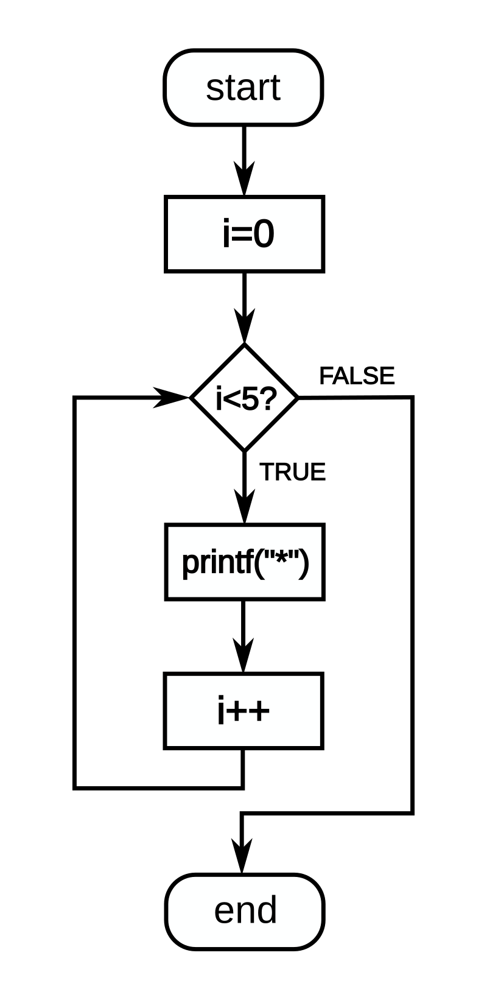
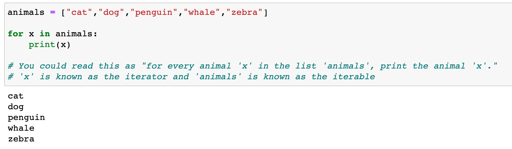
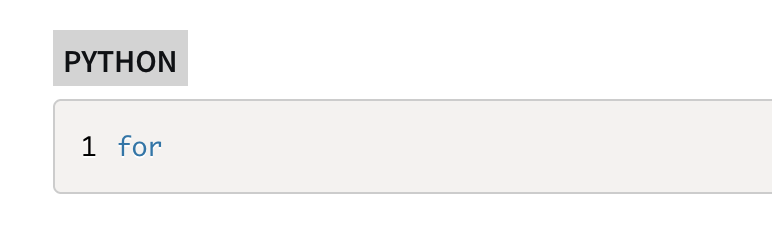
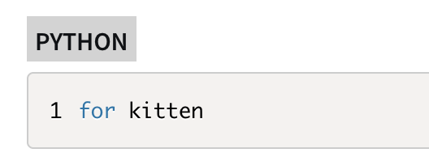
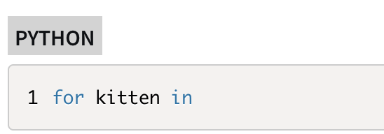
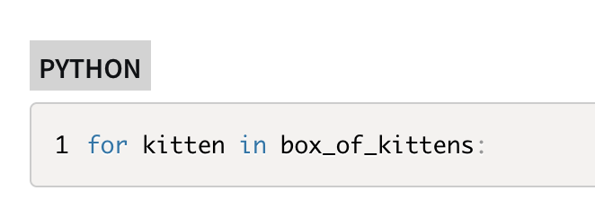
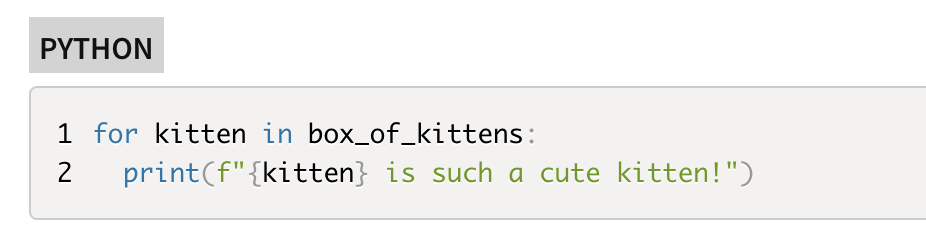
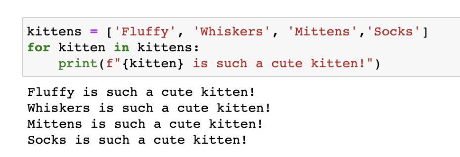

# A beginner's tutorial on for loops  
## What is for loop?  
In computer science, a for-loop or for loop is a control flow statement for specifying iteration. Specifically, a for-loop functions by running a section of code repeatedly until a certain condition has been satisfied. 

For-loops have two parts: a header and a body. The header defines the iteration and the body is the code that is executed once per iteration. The header often declares an explicit loop counter or loop variable. This allows the body to know which iteration is being executed. For-loops are typically used when the number of iterations is known before entering the loop. 

## Examples of for loops
Here is flow diagram of the following for loop code:  
for (i = 0; i < 5; i++)  
 printf("*");  
**Figure 1.**  

## How to write a for loop in Python
First, let’s examine the basic structure of a for loop in Python:  
**Figure 2.**  
for and in are both Python keywords, but you can name your iterator variable and iterable whatever you'd like. Remember to include a colon after your for loop statement, and indent code included in the body of the loop.

Now that we know the syntax, let’s write one.  
**Step 1**  
Tell Python you want to create a for loop by starting the statement with for.  

**Figure 3.**

**Step 2**
Write the iterator variable (or loop variable). The iterator takes on each value in an iterable (for example a list, tuple, or range) in a for loop one at a time during each iteration of the loop.
Example: Suppose you have a list called box_of_kittens [😾😺😼😽] as your iterable. You could name your iterator variable anything you want, but you might choose to call it 'kitten' to reference that you'll be looping through each individual kitten [😺] in box_of_kittens.  

**Figure 4.**

**Step 3**
Use the keyword in.  

**Figure 5.**  

**Step 4**
Add the iterable followed by a colon. The iterable (or sequence variable) is the object you will iterate through. In the example above where the loop variable is a kitten, the sequence variable is box_of_kittens because it represents the grouping the single variable is chosen from.  

**Figure 6.**

**Step 5**
Write your loop statements in an indented block. The indentation lets Python know which statements are inside the loop and which statements are outside the loop.  

**Figure 7.**

Now let's run this code with a list called box_of_kittens and see what we get:  

**Figure8.**

Now try it yourself!